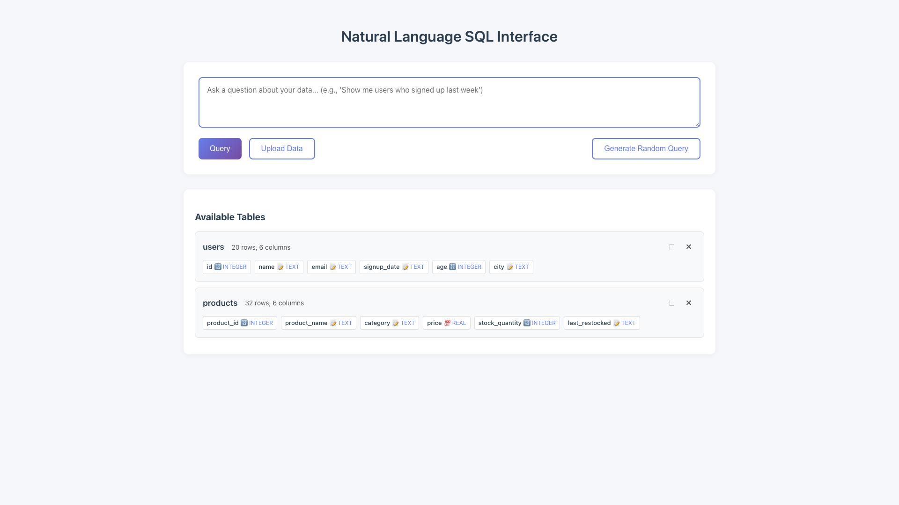
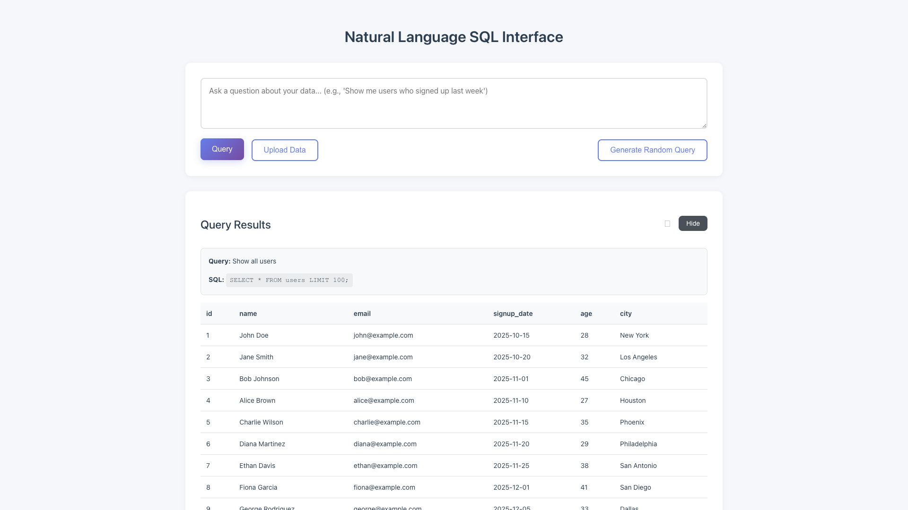
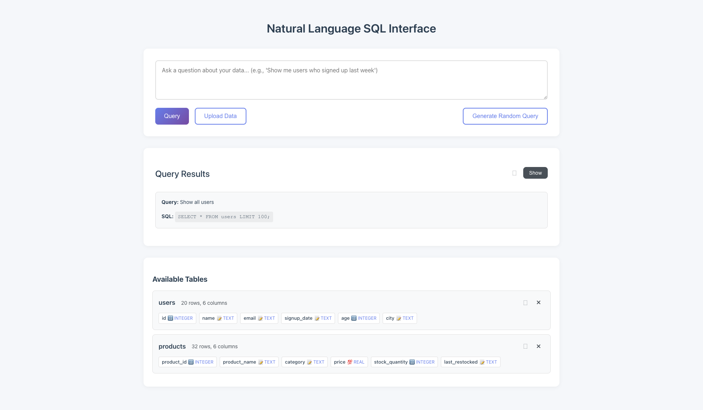

# One-Click CSV Export Feature

**ADW ID:** 0ead5f67
**Date:** 2025-12-31
**Specification:** specs/issue-1-adw-0ead5f67-sdlc_planner-one-click-table-exports.md

## Overview

This feature adds one-click CSV export functionality to the Natural Language SQL Interface application. Users can download any uploaded table or query results as CSV files with a single click, making it easy to extract data for further analysis in spreadsheets or other tools.

## Screenshots


*Download button appears next to each table's remove button*


*Download button appears in the results header next to the Hide button*


*Complete view showing download buttons on both tables and results*

## What Was Built

- **Table Export**: Download button (⬳) next to each table's remove button (×) that exports the entire table as CSV
- **Results Export**: Download button (⬳) in the query results header that exports the current query results as CSV
- **Backend API Endpoints**: Two new endpoints (`/api/export/table/{table_name}` and `/api/export/results`) that handle CSV generation
- **Loading States**: Visual feedback during download operations
- **Error Handling**: Proper error messages for failed exports
- **Comprehensive Testing**: Unit tests and E2E tests for the export functionality

## Technical Implementation

### Files Modified

- `app/server/server.py`: Added two export endpoints with CSV generation logic
- `app/server/core/data_models.py`: Added `ExportResultsRequest` Pydantic model
- `app/client/src/main.ts`: Implemented download buttons and client-side download logic
- `app/client/src/style.css`: Added styling for download buttons and action containers
- `app/server/tests/test_export.py`: Created comprehensive unit tests (323 lines)
- `.claude/commands/e2e/test_table_export.md`: Created E2E test specification

### Key Changes

**Backend (Python/FastAPI):**
- `GET /api/export/table/{table_name}` endpoint validates table name, fetches all rows using secure SQL methods, and returns CSV with proper headers
- `POST /api/export/results` endpoint accepts columns and results arrays, converts to CSV format
- Uses Python's built-in `csv` module for proper escaping of special characters
- Returns `StreamingResponse` with `Content-Type: text/csv` and `Content-Disposition: attachment` headers
- Reuses existing security infrastructure (`validate_identifier`, `check_table_exists`, `execute_query_safely`)

**Frontend (TypeScript):**
- Added `currentResults` global state to store query results for export
- Updated `displayTables()` to add download button next to remove button within a new actions container
- Updated `displayResults()` to add download button next to toggle button and store current results
- Implemented `downloadTable()` and `downloadResults()` functions with loading states and error handling
- Created `triggerDownload()` helper to programmatically trigger browser downloads using Blob URLs

**Styling (CSS):**
- `.download-table-button` and `.download-results-button` classes with hover effects
- `.table-actions` and `.results-actions` containers for button grouping
- Loading spinner styles for download progress indication

## How to Use

### Exporting a Table

1. Upload a CSV or JSON file to create a table
2. Locate the table in the "Available Tables" section
3. Click the download button (⬳) to the left of the remove button (×)
4. The table will be downloaded as `{table_name}.csv`

### Exporting Query Results

1. Enter a natural language query and execute it
2. View the query results in the "Query Results" section
3. Click the download button (⬳) to the left of the "Hide" button
4. The results will be downloaded as `query_results.csv`

### Loading States

- Download buttons show a loading spinner during export operations
- Buttons are disabled while export is in progress to prevent duplicate requests
- Error messages appear in the error banner if export fails

## Configuration

No configuration is required. The feature works out of the box with the existing database setup.

## Testing

### Unit Tests

Run the comprehensive unit test suite:
```bash
cd app/server && uv run pytest app/server/tests/test_export.py
```

Tests cover:
- Valid table exports with correct CSV formatting
- Non-existent table handling (404 errors)
- Invalid/malicious table names (400 errors with SQL injection protection)
- Empty table exports (headers only)
- Results export with various data types
- Special character escaping (commas, quotes, newlines)
- Null value handling
- HTTP header validation

### E2E Tests

Run the end-to-end test:
```bash
# Read the E2E test instructions
cat .claude/commands/test_e2e.md

# Execute the table export E2E test
cat .claude/commands/e2e/test_table_export.md
```

E2E tests verify:
- Download buttons appear in correct positions
- Clicking buttons triggers CSV downloads
- Downloaded files contain correct data
- UI remains functional after exports

### Full Validation

Run all validation commands:
```bash
cd app/server && uv run pytest                 # All server tests
cd app/client && bun tsc --noEmit              # TypeScript type checking
cd app/client && bun run build                 # Frontend build
```

## Notes

- The down arrow symbol (⬳) used for the download icon is Unicode character `U+2B73`, which works across all platforms
- CSV exports use Python's `csv` module which automatically handles proper escaping of special characters (commas, quotes, newlines)
- The `StreamingResponse` from FastAPI ensures efficient memory usage when exporting large tables
- Table export reuses existing SQL security infrastructure to prevent SQL injection attacks
- Results export receives pre-validated data from the client (results from a previous query), so no additional SQL security is needed
- The global `currentResults` state is cleared when query errors occur to prevent exporting stale data
- Consider adding pagination or row limits for very large table exports in future iterations (current implementation loads all rows into memory)
- File downloads are triggered programmatically using Blob URLs and the HTML5 download attribute
